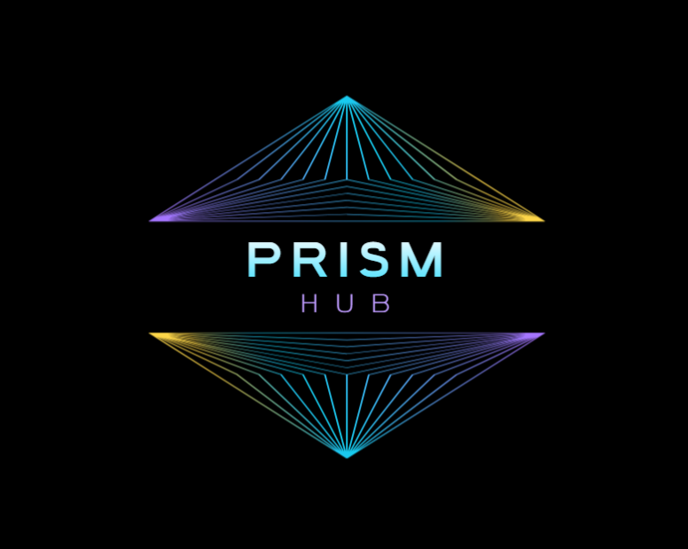

<div align="center">



# PrismHub

**Aplicación multiplataforma para anime, manga y series**

[](LICENSE)
[](https://github.com/Litdemonick/Prism_Hub/stargazers)
[](https://github.com/Litdemonick/Prism_Hub/issues)
[](https://github.com/Litdemonick/Prism_Hub/releases)

</div>

---

## Tabla de contenidos

- [¿Qué es PrismHub?](#qué-es-prismhub)
- [Cómo funciona](#cómo-funciona)
- [Instalación](#instalación)
- [Extensiones](#extensiones)
- [Desarrollo de extensiones](#desarrollo-de-extensiones)
- [Estructura del repositorio](#estructura-del-repositorio)
- [Compilar desde código fuente](#compilar-desde-código-fuente)
- [Licencia](#licencia)

---

## ¿Qué es PrismHub?

PrismHub es una aplicación de streaming multiplataforma (Windows, Android, Linux) para ver anime, leer manga y acceder a series y películas. No está ligada a ningún sitio web específico — funciona a través de **extensiones JavaScript** que puedes instalar, actualizar o crear tú mismo.

### Características

- Sistema de extensiones JS — añade cualquier fuente sin modificar la app
- Multi-servidor con failover automático — si un servidor falla, prueba el siguiente sin salir del episodio
- Historial de visto, favoritos y seguimiento de progreso por episodio
- Integración con AniList (seguimiento automático)
- DLNA / Cast a TV
- Subtítulos externos
- Proxy HLS local y cookie jar persistente para contenido protegido

---

## Cómo funciona

PrismHub carga archivos `.js` (extensiones) y los ejecuta dentro de un motor JavaScript embebido. Cada extensión sabe cómo hablar con un sitio web concreto y devuelve datos en un formato estándar que la app entiende.

```
Usuario abre PrismHub
        │
        ▼
  Flutter UI (Windows / Android / Linux)
        │
        │  llama a latest() / search()
        ▼
  ExtensionService (Dart)
  • Carga el archivo .js de la extensión
  • Inyecta la API: request(), fetch(), CryptoJS, jsencrypt, md5
  • Ejecuta el JS en el motor embebido
        │
        │  motor JS:  QuickJS  (Windows / Android)
        │             JavaScriptCore  (Linux)
        ▼
  Extensión JavaScript
  • Hace scraping / llama a la API del sitio web
  • Devuelve lista de títulos / episodios / URL del stream
        │
        ▼
  Player (media_kit)
  • Recibe { type: 'hls'|'mp4', url, headers }
  • Si el servidor falla → lee header X-Servers
    y prueba el siguiente automáticamente
```

### Flujo completo al reproducir un episodio

| Paso | Qué ocurre |
|------|-----------|
| 1 | App llama a `latest()` o `search(kw, page)` → lista de títulos `[{title, url, cover}]` |
| 2 | Usuario elige un título → app llama a `detail(url)` → lista de episodios |
| 3 | Usuario pulsa un episodio → app llama a `watch(url)` → `{ type, url, headers }` |
| 4 | `media_kit` reproduce la URL directamente |
| 5 | Si el servidor falla → lee `X-Servers` en los headers y cambia de servidor sin salir |

### Almacenamiento local

| Qué | Dónde |
|-----|-------|
| Extensiones instaladas | Hive (clave/valor local) |
| Historial y favoritos | Base de datos Isar (local, sin servidor) |
| Configuración | Hive |
| Caché de imágenes | Sistema de archivos temporal |

---

## Instalación

### Windows

```powershell
irm https://raw.githubusercontent.com/Litdemonick/Prism_Hub/main/install/install.ps1 | iex
```

O descarga el instalador `.exe` directamente desde [Releases](https://github.com/Litdemonick/Prism_Hub/releases/latest).

### Linux

```bash
curl -fsSL https://raw.githubusercontent.com/Litdemonick/Prism_Hub/main/install/install.sh | bash
```

**Arch Linux (PKGBUILD):**
```bash
cd install
makepkg -si
```

### Android

Descarga el `.apk` desde [Releases](https://github.com/Litdemonick/Prism_Hub/releases/latest).

---

## Extensiones

PrismHub se alimenta de una **única fuente**: [**prism+**](https://github.com/Litdemonick/prism-plus), su motor de extensiones oficial. El repo comunitario ya fue fusionado dentro de prism+, así que todo el catálogo (161 extensiones) vive en un solo sitio.

```
https://raw.githubusercontent.com/Litdemonick/prism-plus/main/index.json
```

### Cómo funciona

- **10 extensiones nativas vienen pre-instaladas y activas** al primer arranque (TioAnime, AnimeFLV, MonosChinos, Animepahe, MangaDex, MangaBat, Comick, OmegaScans, Jikan, YTS). Se descargan de prism+ — no van empaquetadas en la app, así que siempre están al día.
- Las **otras ~151 extensiones** de la comunidad están en el catálogo, listas para **instalar cuando quieras** desde **Repositorio de extensiones**.
- Cada extensión tiene un **switch para activar/desactivar** sin desinstalarla. Las desactivadas no aparecen en la búsqueda.
- **Bloqueo de duplicados:** si intentas importar desde fuera una extensión que prism+ ya trae de forma nativa, la app la bloquea con un aviso — la versión nativa tiene prioridad.
- Si añades una extensión externa propia (URL o archivo `.js`), se guarda en tu sistema y carga normalmente.

### Añadir / actualizar extensiones

1. Abre PrismHub → **Extensiones**
2. Pulsa el icono de **descarga** para ver el **Repositorio de extensiones** (catálogo prism+)
3. Instala las que quieras; usa el **switch** para activarlas o desactivarlas

> prism+ es la única fuente y solo su mantenedor publica extensiones. El repo es público (para que la app pueda descargarlas) pero cerrado a contribuciones externas.

---

## Desarrollo de extensiones

Las extensiones son archivos JavaScript con el siguiente formato:

```javascript
// ==PrismHubExtension==
// @name         MiExtension
// @version      1.0.0
// @author       TuNombre
// @lang         es
// @license      MIT
// @package      com.tudominio.miextension
// @type         bangumi
// @webSite      https://sitio.com
// ==/PrismHubExtension==

export default class extends Extension {
  async latest(page) { /* retorna [{title, url, cover}] */ }
  async search(kw, page) { /* retorna [{title, url, cover}] */ }
  async detail(url) { /* retorna {title, cover, desc, episodes:[...]} */ }
  async watch(url) { /* retorna {type:'hls'|'mp4', url, headers} */ }
}
```

### API disponible en extensiones

| Método | Descripción |
|--------|-------------|
| `this.request('/ruta')` | HTTP al sitio base (`webSite` + ruta) — incluye UA y cookies |
| `fetch(url, options)` | HTTP a cualquier URL externa |
| `this.querySelector(html, selector)` | Selector CSS sobre HTML |
| `this.queryXPath(html, xpath)` | XPath sobre HTML |
| `CryptoJS` | Librería CryptoJS (pre-cargada) |
| `md5(str)` | Hash MD5 |

### Tipos de extensión

| Tipo | `@type` | `watch()` retorna |
|------|---------|-------------------|
| Anime / Series | `bangumi` | `{ type: 'hls'\|'mp4', url, headers }` |
| Manga / Cómic | `manga` | `{ urls: ['img1', 'img2', ...], headers }` |
| Novela | `fikushon` | `{ title, content: ['párrafo...'] }` |

### Failover multi-servidor

Si tu extensión soporta varios servidores de video, pásalos en los headers para que el player cambie automáticamente si uno falla:

```javascript
return {
  type: 'hls',
  url: primaryUrl,
  headers: {
    'X-Servers': JSON.stringify({ 'Servidor2': embedUrl2, 'Servidor3': embedUrl3 }),
    'X-Primary-Server': 'Servidor1'
  }
}
```

---

## Estructura del repositorio

```
Prism_Hub/
├── lib/                    ← Código fuente Flutter
│   ├── controllers/        ← Lógica de negocio (GetX)
│   ├── data/services/      ← Runtime JS, base de datos Isar
│   ├── models/             ← Modelos de datos
│   ├── utils/              ← Utilidades, storage, peticiones HTTP
│   └── views/              ← UI (páginas y widgets)
├── extensions/             ← Extensiones de la comunidad (150+)
├── assets/
│   ├── i18n/               ← Traducciones (es.json, en.json, zh.json…)
│   ├── js/                 ← CryptoJS, jsencrypt, md5 (runtime)
│   └── icon/               ← Iconos de la app
├── icons/                  ← Logo e iconos del proyecto
├── install/                ← Scripts de instalación (Windows/Linux/Arch)
├── .github/workflows/      ← CI/CD (release, build, pages)
├── index.json              ← Catálogo de extensiones de la comunidad
└── pubspec.yaml            ← Dependencias Flutter
```

---

## Compilar desde código fuente

```bash
# Requiere Flutter 3.22+
flutter pub get
flutter build windows --release   # Windows
flutter build apk --release       # Android
flutter build linux --release     # Linux
```

---

## Licencia

PrismHub se distribuye bajo la licencia **[AGPL-3.0](LICENSE)**.

**En resumen:**
- Puedes usar, modificar y distribuir la app libremente
- Si distribuyes una versión modificada (incluso en un servidor), debes publicar el código fuente con los mismos términos
- La app es de código abierto y siempre lo será

Copyright © 2026 Soul_Of_The_sun — [github.com/Litdemonick](https://github.com/Litdemonick)

---

<div align="center">

**PrismHub** — Tu portal de entretenimiento en español

[Releases](https://github.com/Litdemonick/Prism_Hub/releases) · [Issues](https://github.com/Litdemonick/Prism_Hub/issues) · [prism+ extensions](https://github.com/Litdemonick/prism-plus)

</div>
