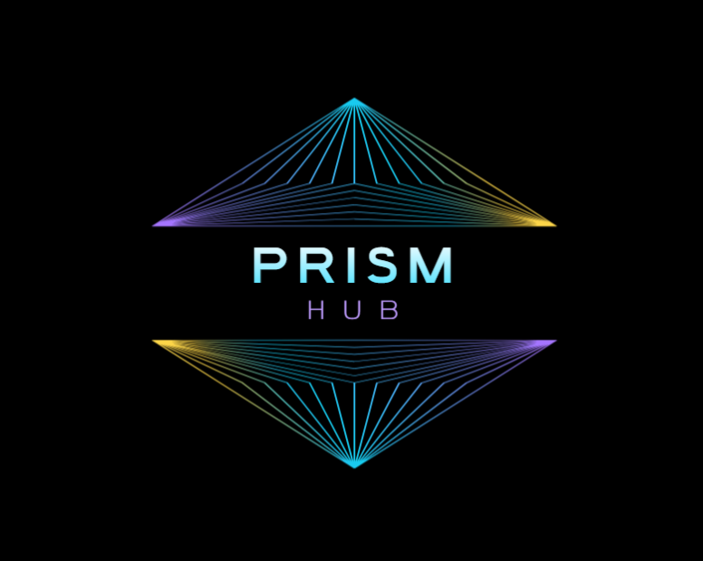

# PrismHub se mudó

**Este repositorio quedó como puente — la app real vive en otro lado.**

---

## ¿Por qué existe esto?

Vos veniste acá porque tenías guardado (o la propia app te trajo a) este
link. Este repositorio **ya no tiene nada** — ni código, ni descargas
nuevas, ni novedades — sólo existe para que quien todavía tenga una
versión vieja de PrismHub pueda encontrar el camino al lugar correcto.

Si sos una persona, no una app, andá directo acá:

### 👉 **[litdemonick.github.io/PrismHub](https://litdemonick.github.io/PrismHub/)**

## ¿Qué pasó?

El código de PrismHub pasó a ser privado. La cara pública del proyecto —
instaladores, notas de cada versión, dónde reportar un fallo — se mudó
entera a un repositorio nuevo:

**[Litdemonick/PrismHub](https://github.com/Litdemonick/PrismHub)**

Ese es el lugar para todo de ahora en más: descargar la app, ver qué
cambió en cada versión, o abrir un Issue si encontraste algo roto.
